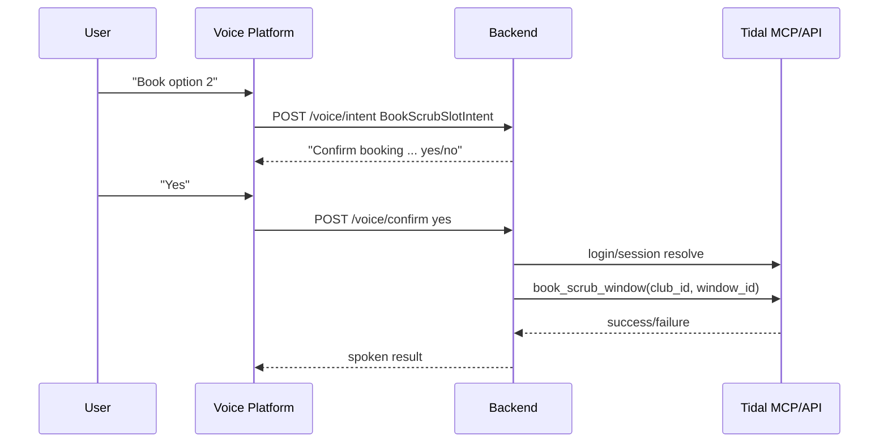

# Smart Speaker MVP Backend

## Setup
1. `cd voice && npm install`
2. `cd ..` then copy `.env.example` to `.env` and fill values.
3. Run `cd voice && npm run dev`.

## Webhook API
### POST /voice/intent
```bash
curl -X POST http://localhost:4010/voice/intent \
 -H 'content-type: application/json' \
 -d '{"sessionId":"abc","intentName":"GetTideSummaryIntent","slots":{"station_name":"Seattle","date":"today"}}'
```

### POST /voice/confirm
```bash
curl -X POST http://localhost:4010/voice/confirm \
 -H 'content-type: application/json' \
 -d '{"sessionId":"abc","confirmation":"yes"}'
```

## Booking flow sequence diagram


## TODO: Adapter glue
- Alexa request signature verification and response envelope mapping.
- Google Assistant App Actions intent schema mapping.
- Platform-specific session persistence bridge.
- SSML tuning per assistant voice.

## Alexa adapter
- Endpoint: `POST /alexa/webhook`
- Signature verification is enabled by default using `Signature` and `SignatureCertChainUrl` headers.
- For local testing only, set `ALEXA_SKIP_SIGNATURE_VERIFY=true`.

### Local Alexa webhook test
```bash
curl -X POST http://localhost:4010/alexa/webhook \
 -H 'content-type: application/json' \
 -d '{"version":"1.0","session":{"sessionId":"amzn1.echo-api.session.1"},"request":{"type":"LaunchRequest","requestId":"req-1","timestamp":"2026-05-10T00:00:00Z"}}'
```


## Railway stability note
- Voice tooling dependencies are isolated in `voice/package.json` so the root lockfile used by Railway `npm ci` remains stable.
- Deployments continue to use the root app build; voice backend can be built/tested independently from `voice/`.
